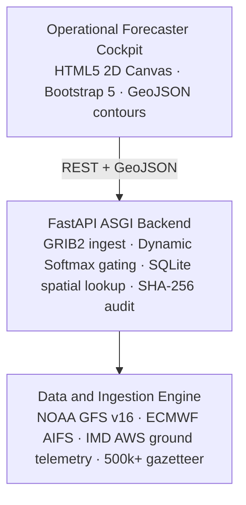

# VayuSync

### Sub-district meteorological synthesis & real-time monsoonal intelligence engine

<p align="center">
  
  
  
  
  
  
  
</p>

**VayuSync** is an operational meteorological synthesis platform that bridges classical dynamical atmospheric physics (**NOAA GFS v16**) and global data-driven neural weather prediction (**ECMWF AIFS**).

Built for **operational speed and statutory accountability**: dynamic Softmax gating against ground truth, sub-12ms village gazetteer downscaling, and instant alert workflows — without heavy GPU infrastructure.

---

## Highlights

| Capability | What it delivers |
|---|---|
| **Dual-model synthesis** | Dynamic Softmax weighting balancing GFS physics with AIFS neural skill |
| **Causal verification** | 7-day trailing residual window strictly free of future-data leakage |
| **Sub-district drill-down** | 500k+ Indian village centroids resolved in under 12ms via embedded SQLite |
| **Forecaster cockpit** | Client-side 2D Canvas isobar rendering with zero server rasterization lag |
| **Statutory defensibility** | Cryptographic SHA-256 audit logs supporting Sec 163 BNSS disaster orders |
| **Zero GPU footprint** | SIMD NumPy vectorization runs entirely on a commodity 2-core x86 CPU |

---

## Architecture



---

## What VayuSync does

VayuSync is designed for **monsoon-season operations** where decisions must be fast, local, and defensible:

1. **Ingest** multi-source forecast fields (GFS dynamical + AIFS neural) and ground telemetry  
2. **Gate** model contributions with a causal Softmax residual window (no future leakage)  
3. **Downscale** to sub-district / village centroids from an embedded spatial gazetteer  
4. **Render** isobars and operational layers in a browser cockpit (Canvas, no server tiles)  
5. **Audit** every synthesis and alert path with SHA-256 logs for statutory review  

---

## Core modules

### Dual-model synthesis engine
- Blends **NOAA GFS v16** (physics-first) and **ECMWF AIFS** (data-driven skill)
- **Dynamic Softmax gating** updates weights from recent residual performance against ground truth
- Designed so neither model dominates blindly when local skill shifts during active monsoon phases

### Causal verification window
- Rolling **7-day trailing residual** evaluation
- Strictly causal: verification never uses future observations relative to the decision time
- Supports transparent model confidence for operational briefings

### Sub-district gazetteer
- Embedded **SQLite** spatial lookup over **500k+** Indian village centroids
- Target resolution latency **under 12ms** for interactive drill-down
- Enables village- and tehsil-scale products without external GIS servers

### Forecaster cockpit
- **HTML5 2D Canvas** isobar / contour rendering on the client
- **GeoJSON** payloads from the API — no heavy server-side raster pipeline
- Dark operational console UI for continuous monitoring

### Statutory audit trail
- **SHA-256** cryptographic logs of synthesis outputs and alert issuance
- Oriented toward accountability workflows under **Sec 163 BNSS** disaster-order contexts
- Replay-friendly audit records for post-event review

---

## Quick start

```bash
# 1. Clone
git clone https://github.com/samprit07/vayusync.git
cd vayusync

# 2. Environment
python -m venv .venv
# Windows
.venv\Scripts\activate
# macOS / Linux
source .venv/bin/activate

pip install -r requirements.txt

# 3. Run API + cockpit
uvicorn app.main:app --reload --host 127.0.0.1 --port 8000
```

Open **[http://127.0.0.1:8000](http://127.0.0.1:8000)**

> Replace `YOUR_USERNAME/vayusync` with your actual GitHub path.

---

## Project structure

```text
vayusync/
├── app/
│   ├── main.py                 # FastAPI entry · CORS · static cockpit mount
│   ├── synthesis/              # Softmax gating · residual window · blend logic
│   ├── ingest/                 # GRIB2 / model field ingestion adapters
│   ├── spatial/                # Village gazetteer · SQLite spatial queries
│   ├── audit/                  # SHA-256 audit log writers
│   └── routers/                # Forecast · lookup · alert · health APIs
├── frontend/                   # Forecaster cockpit (Canvas · Bootstrap · dark UI)
├── data/
│   ├── gazetteer/              # Village centroid SQLite / seed assets
│   └── samples/                # Demo GRIB / GeoJSON fixtures (if bundled)
├── requirements.txt
└── README.md
```

*(Adjust folder names to match your repo if they differ slightly.)*

---

## API surface (illustrative)

| Area | Role |
|------|------|
| Health | Service liveness and ingest heartbeat |
| Synthesis | Gated dual-model field / point forecasts |
| Spatial lookup | Village / sub-district resolution under 12ms target |
| Contours | GeoJSON isobar / layer payloads for Canvas |
| Alerts | Threshold workflows with audit stamps |
| Audit | SHA-256 log query / verification helpers |

Interactive docs when the server is running:

- Swagger UI → [http://127.0.0.1:8000/docs](http://127.0.0.1:8000/docs)
- ReDoc → [http://127.0.0.1:8000/redoc](http://127.0.0.1:8000/redoc)

---

## Tech stack

| Layer | Choices |
|-------|---------|
| API | FastAPI (ASGI), Pydantic |
| Compute | NumPy SIMD vectorization (CPU-only path) |
| Spatial | Embedded SQLite gazetteer |
| Ingest | GRIB2-oriented model field pipelines |
| UI | HTML5 Canvas, Bootstrap 5, dark operational console |
| Integrity | SHA-256 audit logging |

---

## Design principles

1. **Physics + learning, not either/or** — GFS and AIFS are gated, not averaged blindly.  
2. **Causal by construction** — verification windows never peek into the future.  
3. **Locality first** — products must resolve to sub-district and village scale.  
4. **Operational latency** — cockpit rendering stays on the client; lookups stay in-process.  
5. **Defensible outputs** — every critical synthesis path is hash-audited for statutory review.  
6. **Commodity hardware** — no GPU dependency for the core synthesis path.

---

## Operational notes

- **Monsoon focus** — synthesis and alerts are oriented toward active monsoonal regimes and rapid local escalation.  
- **Ground truth coupling** — Softmax gates track residual skill against telemetry (e.g. IMD AWS-class signals where available).  
- **CPU-only deployment** — suitable for constrained institutional or field-adjacent servers.  
- **Audit retention** — retain SHA-256 logs according to your disaster-management record policy.

---

## Problem alignment (SIH 2026)

- Dual-source weather intelligence (dynamical + neural)  
- Sub-district / village-scale actionable products  
- Real-time operational cockpit for forecasters  
- Transparent model weighting with causal verification  
- Auditability suitable for statutory disaster workflows  
- Efficient CPU-side numerical path (NumPy SIMD)

---

## License

Prepared in the context of **Smart India Hackathon 2026**.  
Add a formal license file if you open-source beyond the competition setting.

---

<p align="center">
  <strong>VayuSync</strong> — from global model fields to village-scale monsoonal decisions.
</p>
